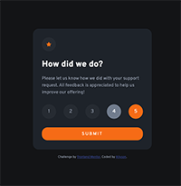
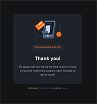

# Frontend Mentor - Interactive rating component solution

This is a solution to the [Interactive rating component challenge on Frontend Mentor](https://www.frontendmentor.io/challenges/interactive-rating-component-koxpeBUmI). Frontend Mentor challenges help you improve your coding skills by building realistic projects.

## Table of contents

- [Overview](#overview)
  - [The challenge](#the-challenge)
  - [Screenshot](#screenshot)
  - [Links](#links)
- [My process](#my-process)
  - [Built with](#built-with)
  - [What I learned](#what-i-learned)
  - [Continued development](#continued-development)
  - [Useful resources](#useful-resources)
- [Author](#author)
- [Acknowledgments](#acknowledgments)

**Note: Delete this note and update the table of contents based on what sections you keep.**

## Overview

### The challenge

Users should be able to:

- View the optimal layout for the app depending on their device's screen size
- See hover states for all interactive elements on the page
- Select and submit a number rating
- See the "Thank you" card state after submitting a rating

### Screenshot




### Links

- Solution URL: [https://github.com/allyson-s-code/interactive-rating-component](https://github.com/allyson-s-code/interactive-rating-component)
- Live Site URL: [https://allyson-s-code.github.io/interactive-rating-component/](https://allyson-s-code.github.io/interactive-rating-component/)

## My process

### Built with

- Semantic HTML5 markup
- CSS custom properties
- Flexbox
- Mobile-first workflow
- JavaScript

### What I learned

I learned a lot with this project. It's a very basic project but it was very helpfull for me in gaining confidence building the html, css, and interactive components from the ground up (with just a jpeg design file) and away from tutorials.

I tried to make my component accessible by creating labels for the buttons in the form element in html. This is my first time doing this and I hope that it adds to the functionality for the users. I also learned that the rating buttons and submit buttons default setting causes the page to reload upon "click" so that took some research. In the end I added `type="button"` to my `button` element and `onclick="return false;"` to my submit button to keep the page from automatically refreshing.

I also learned a new css trick to keep my `:active` button style after click:

```css
button:focus {
  background-color: hsl(216, 12%, 54%);
  color: hsl(0, 0%, 100%);
}
```

### Continued development

I decided to keep my vanilla javaScript code as is until I feel more comfortable with the ES6 syntax. As I continue with my review and development I plan on upgrading to ES6. I will also continue creating more complex web pages and components with more interactivity.

### Useful resources

- [freeCodeCamp explains var, let, const](https://www.freecodecamp.org/news/var-let-and-const-whats-the-difference/) - This helped me with my var, let, const confusion.

## Author

- Website - [Allyson Smith](https://allyson-s-code.github.io/Web-Dev-Portfolio/)
- Frontend Mentor - [@allyson-s-code](https://www.frontendmentor.io/profile/allyson-s-code)

## Acknowledgments

This is a general shoutout to all the developers asking and answering questions on stackoverflow and other web resources. What a great community. I hope to eventually add more answers than questions as I move forward on this journey! :)
